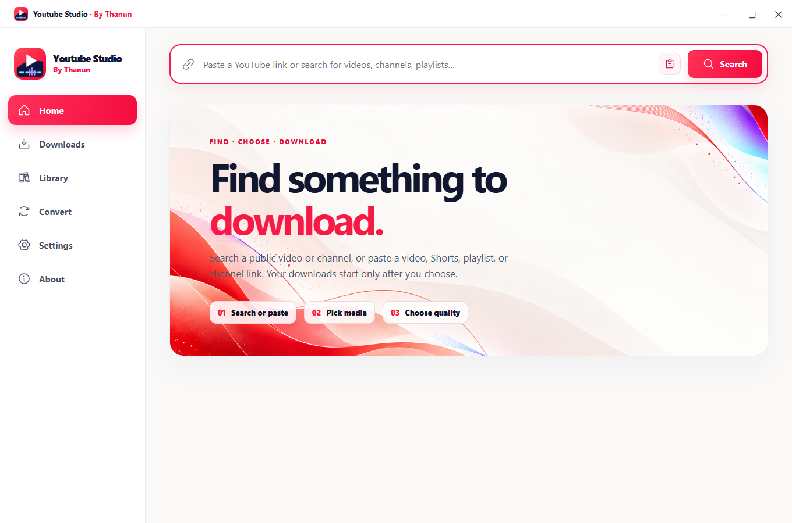
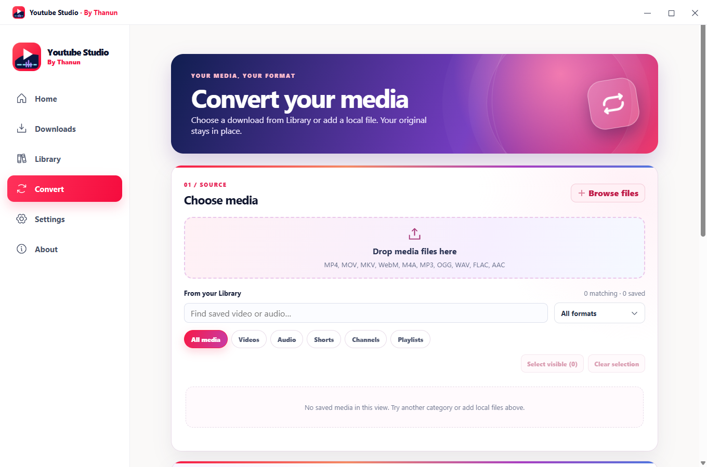
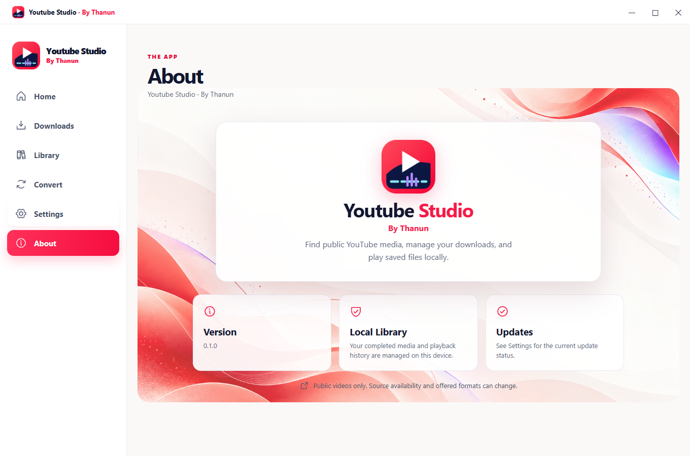

# Youtube Studio

### By Thanun

**Find it · Choose it · Keep it**

A colorful Windows app for saving public YouTube videos and audio, managing downloads, and playing files locally.

## A simpler way to keep public media

**Search or paste.** Find a public video or channel by name, or paste a video, Short, playlist, or channel link. Preview media and choose from the formats actually offered.

**Pick a few or a whole collection.** Select videos from a playlist or channel, choose video quality or audio, and add the batch in one action.

**See what is happening.** Downloads shows active work, measured progress, pause and retry actions, and recovery after a restart. Library plays verified files and keeps saved versions together.

**Make it yours.** Convert selected Library files or your own local media in a batch. Originals stay in place.

## V1 · Official Build

[Download V1 for Windows x64](https://github.com/Thanun-Coding/Youtube-Studio---Release/releases/tag/v1.0.0): choose **Setup** for installation or **Portable** to run without installation. Package version: **1.0.0**. See [V1 release notes](RELEASE_NOTES_V1.md) for the latest improvements, verification and remaining limits. SHA-256 checksums and Runtime Source Information accompany the downloads.

The Windows executables are **unsigned**, by the owner's decision. Windows may show an unknown-publisher warning. The app supports public content only; it does not request YouTube login or cookies. Source availability, offered qualities, and captions can change. Complete linked-dependency source/reproducibility review and physical failure testing remain incomplete; the supplied source-information archive does not certify those checks.

## Refreshed official V1

The new update popup shows verified release details, live progress, cancellation/retry and readiness to install. Closing it preserves the download; automatic offers wait for fullscreen playback to finish. Background batch preparation, floating progress, data-preserving history clearing and themed controls remain included.

This release replaces the earlier V1 and 1.1.0 downloads. Existing users should install this replacement manually: automatic updates offer only numerically newer versions.

## Updates

Installed builds are configured to check this repository's stable HTTPS feed. A future update is downloaded only after its release metadata signature and installer SHA-256 match. Applying an update still asks you to open the verified installer. Portable builds are replaced manually. No update is offered before a newer reviewed release and a signed `updates/stable.json` are published.

Youtube Studio · By Thanun · Windows x64

